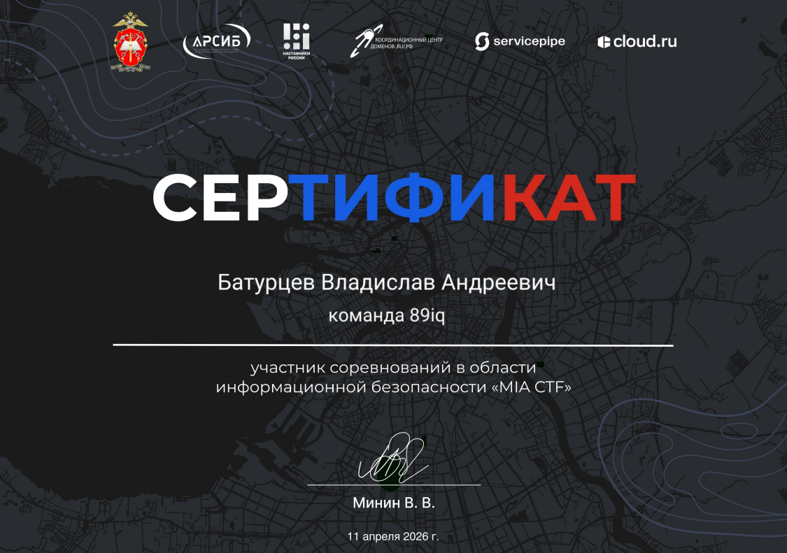
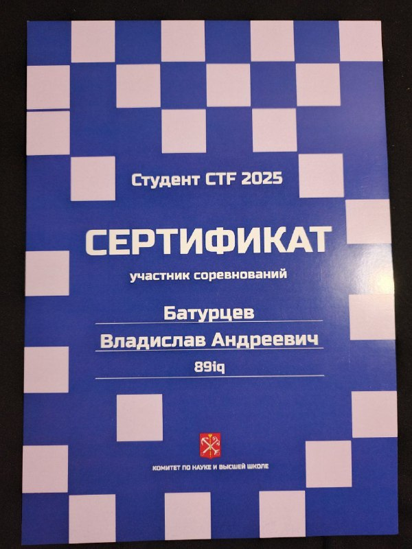
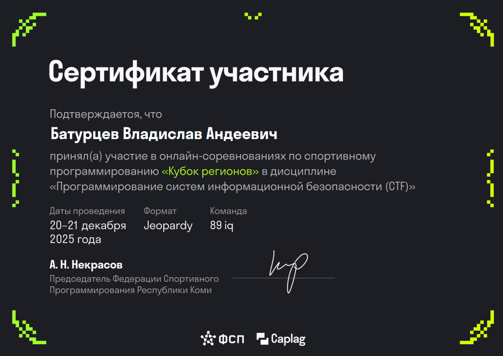
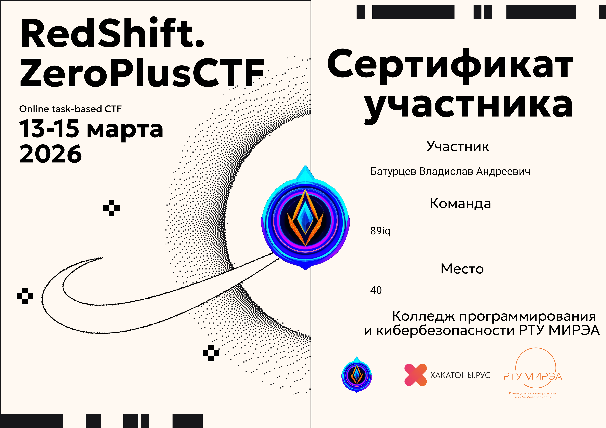
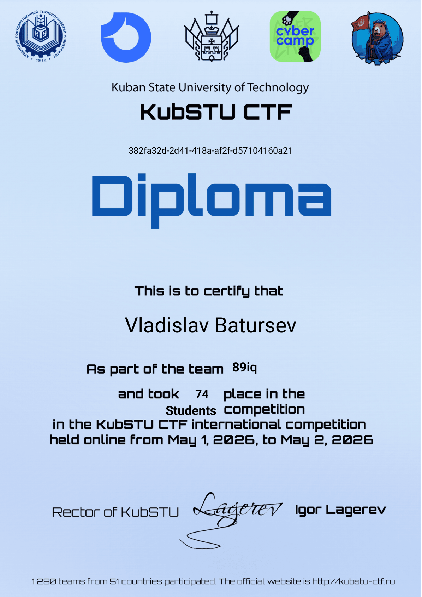
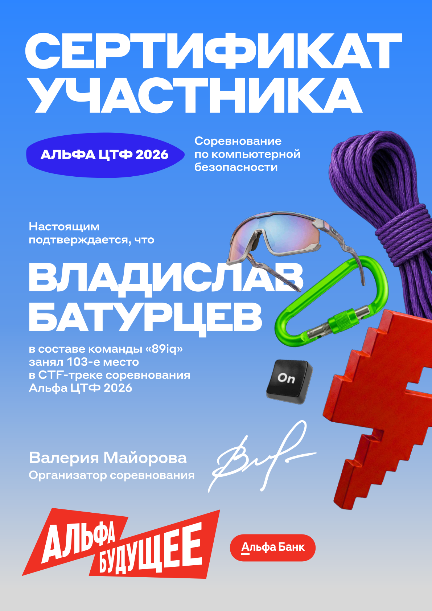
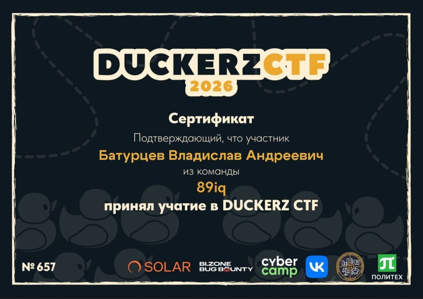

# Certifications & Achievements

## English

This section documents professional certifications, competition achievements, and other credentials related to cybersecurity and software development.

---

### 🏆 CTF Achievements

#### 🏛️ MIA CTF 2026

**Organizer**: Saint Petersburg University of the Ministry of Internal Affairs of Russia & ARSIB  
**Date**: April 11, 2026 · Online, Jeopardy  
**Result**: 🥈 4th place among universities · 7th place overall  
**Results page**: [miactf.ru/results](https://miactf.ru/results)

---

#### 🎓 Student CTF 2025

**Organizer**: Committee for Science and Higher Education of St. Petersburg  
**Date**: October 26, 2025 (final) · Attack-Defense  
**Result**: 🏅 8th place in the final · team 89iq  
**Results page**: [ctfs.spb.ru](http://ctfs.spb.ru/)

---

#### 🗺️ Regions Cup 2025

**Organizer**: [capflag](https://caplag.ru)  
**Date**: December 20–21, 2025 · Online, Jeopardy  
**Result**: 18th place  
**Scoreboard**: [caplag.ru/competitions/kubok-regionov/scoreboard](https://caplag.ru/competitions/kubok-regionov/scoreboard)

---

#### 🔴 RedShift CTF 2026

**Organizer**: o1d_bu7_go1d  
**Date**: March 13–15, 2026 · Online, Jeopardy  
**Result**: 40th place  
**CTFtime**: [RedShift.ZeroPlusCTF-3](https://ctftime.org/event/3191)

---

#### 🦫 KubSTU CTF 2026

**Organizer**: Kuban State University of Technology  
**Date**: May 1–2, 2026 · Online, Jeopardy  
**Result**: 74th place in the Students track · team 89iq (1280 teams · 51 countries)  
**Official site**: [kubstu-ctf.ru](https://kubstu-ctf.ru/)

---

#### 🅰️ Alfa CTF 2026

**Organizer**: [SPbCTF](https://spbctf.com/) community (Saint Petersburg CTF)  
**Sponsor**: Alfa-Bank («Альфа Будущее» programme)  
**Date**: April 25, 2026 · Online & Alfa-Bank IT-hubs, Jeopardy  
**Result**: 103rd place in the CTF track · team 89iq  
**CTFtime**: [Alfa CTF 2026](https://ctftime.org/event/3250/)

---

#### 🦆 DUCKERZ CTF 2026

**Organizer**: DUCKERZ  
**Date**: February 7–8, 2026 · Online, Jeopardy  
**CTFtime**: [DUCKERZ CTF 2026](https://ctftime.org/event/3067/)

---

### 📜 Professional Certifications

#### 🔐 Information Security Internship — Б152

**Organizer**: Б152 (ООО «Б152»)  
**Topic**: Personal Data Protection Systems Design  
**Program**: Information Security Systems Design (*Проектирование систем защиты*)  
**Signed by**: Лагутин Максим Дмитриевич, Executive Director

---

## Russian

В этом разделе собраны профессиональные сертификаты, достижения в соревнованиях и другие подтверждённые навыки.

---

### 🏆 CTF-достижения

#### 🏛️ MIA CTF 2026

**Организатор**: Санкт-Петербургский университет МВД России совместно с АРСИБ  
**Дата**: 11 апреля 2026 · Онлайн, Jeopardy  
**Результат**: 🥈 4-е место среди вузов · 7-е место в общем рейтинге  
**Результаты**: [miactf.ru/results](https://miactf.ru/results)

---

#### 🎓 Студент CTF 2025

**Организатор**: Комитет по науке и высшей школе Санкт-Петербурга  
**Дата**: 26 октября 2025 (финал) · Attack-Defense  
**Результат**: 🏅 8-е место в финале · команда «89iq»  
**Результаты**: [ctfs.spb.ru](http://ctfs.spb.ru/)

---

#### 🗺️ Кубок регионов 2025

**Организатор**: [capflag](https://caplag.ru)  
**Дата**: 20–21 декабря 2025 · Онлайн, Jeopardy  
**Результат**: 18-е место  
**Таблица результатов**: [caplag.ru/competitions/kubok-regionov/scoreboard](https://caplag.ru/competitions/kubok-regionov/scoreboard)

---

#### 🔴 RedShift CTF 2026

**Организатор**: o1d_bu7_go1d  
**Дата**: 13–15 марта 2026 · Онлайн, Jeopardy  
**Результат**: 40-е место  
**CTFtime**: [RedShift.ZeroPlusCTF-3](https://ctftime.org/event/3191)

---

#### 🦫 KubSTU CTF 2026

**Организатор**: Кубанский государственный технологический университет (КубГТУ)  
**Дата**: 1–2 мая 2026 · Онлайн, Jeopardy  
**Результат**: 74-е место в студенческом зачёте · команда «89iq» (1280 команд · 51 страна)  
**Официальный сайт**: [kubstu-ctf.ru](https://kubstu-ctf.ru/)

---

#### 🅰️ Альфа ЦТФ 2026

**Организатор**: сообщество [SPbCTF](https://spbctf.com/) (Saint Petersburg CTF)  
**Спонсор**: Альфа-Банк (программа «Альфа Будущее»)  
**Дата**: 25 апреля 2026 · Онлайн и ИТ-хабы Альфа-Банка, Jeopardy  
**Результат**: 103-е место в CTF-треке · команда «89iq»  
**CTFtime**: [Alfa CTF 2026](https://ctftime.org/event/3250/)

---

#### 🦆 DUCKERZ CTF 2026

**Организатор**: DUCKERZ  
**Дата**: 7–8 февраля 2026 · Онлайн, Jeopardy  
**CTFtime**: [DUCKERZ CTF 2026](https://ctftime.org/event/3067/)

---

### 📜 Профессиональные сертификаты

#### 🔐 Стажировка по информационной безопасности — Б152

**Организатор**: ООО «Б152»  
**Тема**: Проектирование систем защиты персональных данных  
**Программа**: Проектирование систем защиты  
**Подписал**: Лагутин Максим Дмитриевич, Исполнительный директор

