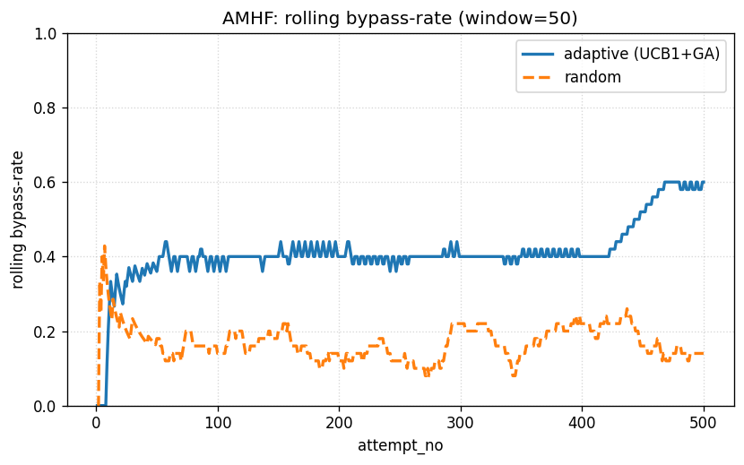
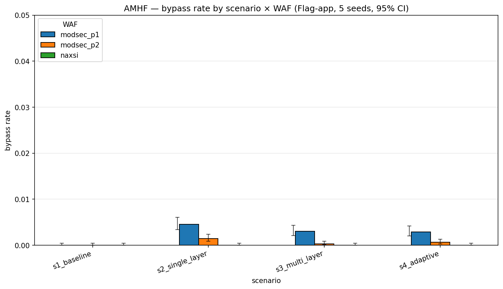
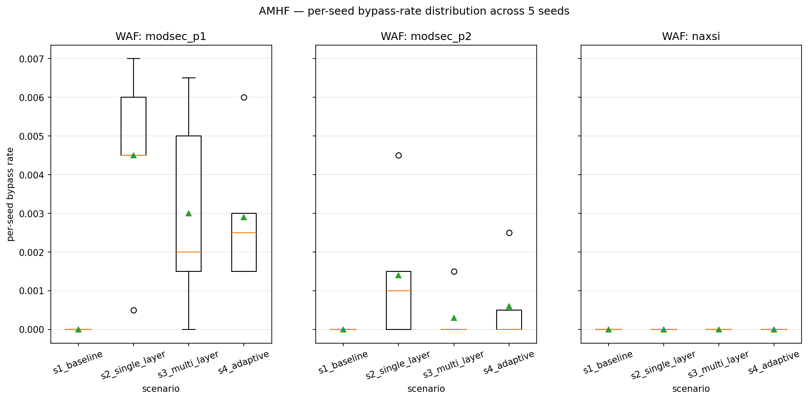
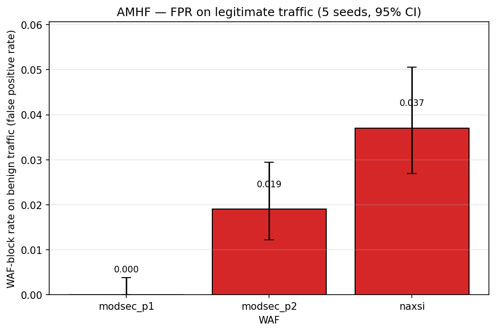

# AMHF — Adaptive Multi-layer HTTP Fuzzer


<a id="en"></a>
**English** · [Русский](#ru)

> **Disclaimer.** AMHF is a research tool intended for educational use only
> and authorized security testing in isolated environments. Use against
> systems you do not own or have written permission to test is prohibited.

AMHF is the practical artifact of a bachelor's thesis on *researching and
implementing a WAF-bypass methodology based on generating adaptive, obfuscated
HTTP requests*. It combines a four-layer mutation engine (payload, body,
headers, URL), a UCB1 multi-armed bandit over chromosome-shaped mutator chains,
a genetic algorithm for evolving the pool, and a dual oracle (WAF + backend +
timing) that confirms an actual successful exploit — not merely a request
slipping past the filter.

The goal is an academically clean, reproducible experiment: 31 mutation
techniques, a 264-payload corpus, two WAFs (ModSec+CRS, NAXSI) over two
backends in a Docker stand. The measured asymmetry between the bypass rate of
the adaptive and random-baseline modes is the project's headline result.

## Quickstart

Requires Python ≥ 3.11 (target: 3.14.0) and Docker Desktop with the WSL2
backend.

```bash
python -m venv .venv
. .venv/bin/activate            # Windows: .venv\Scripts\activate
pip install -e ".[dev]"

amhf version                    # sanity check
amhf list-mutators              # 31 registered mutators
amhf validate -c configs/default.yaml
amhf demo                       # 100 requests against an in-process mock
amhf run -c configs/scenarios/s4_adaptive_modsec_p1_flag.yaml
```

The CLI has exactly five commands (FROZEN): `run`, `demo`, `validate`,
`list-mutators`, `version`.

## Layout

| Path          | Contents |
|---------------|----------|
| `amhf/`       | Library code (mutators, scheduler, oracle, delivery, storage). |
| `configs/`    | `default.yaml` + 12 production scenarios in `scenarios/`. |
| `corpus/`     | YAML payload corpus (264 entries: sqli, xss, cmdi, pathtrav). |
| `docs/`       | Full documentation (see below). |
| `stand/`      | Docker stand (ModSec, NAXSI, Flag-app, DVWA, MariaDB). |
| `tests/`      | unit + integration tests, fixtures, conftest. |
| `scripts/`    | `smoke_stand.py`, `run_experiments.py`, `collect_results.py`. |

## Documentation

- [`docs/CONFIG.md`](docs/CONFIG.md) — full `configs/default.yaml` reference +
  the complete 31-mutator-id alphabet + a diff view of the scenarios.
- [`docs/LIMITATIONS.md`](docs/LIMITATIONS.md) — academic self-criticism and
  future-work directions.

## Stand operations

```sh
make stand-up                    # docker compose up -d --build
python scripts/smoke_stand.py    # rich-table validation
make stand-down                  # docker compose down
```

Full instructions (Linux/WSL and Windows PowerShell), the version pin table,
credentials, and known limitations — see `docs/STAND.md` and `stand/README.md`.

## Empirical highlight

Stage 4 e2e benchmark (`tests/integration/test_e2e_adaptive.py`): the adaptive
scheduler (UCB1 + GA) vs a uniform-random baseline against the same strict-WAF
mock (only `double_url_encode` gets through), 3 seeds × 500 attempts × 2 modes.
Headline assertion:

```
median(adaptive_rate) >= 2.0 * median(random_rate)
```

**Stage 6 production grid** (12 scenarios × 2,000 attempts × 3 WAF
configurations — 24,000 attempts total + 600 FPR attempts):

| WAF \\ scenario | S1 baseline | S2 single-layer | S3 multi-layer | S4 adaptive |
|---|---:|---:|---:|---:|
| ModSec+CRS p1 | 0.0% (1979 blk) | **0.75%** (15/2000) | 0.0% (1878 blk) | 0.10% (2/2000) |
| ModSec+CRS p2 | 0.0% (2000 blk) | 0.20% (4/2000) | 0.0% (2000 blk) | 0.0% (1993 blk) |
| NAXSI 1.6 | 0.0% (1946 blk) | 0.0% (1989 blk) | 0.0% (1967 blk) | 0.0% (1977 blk) |

FPR on 200 benign payloads: ModSec p1 = 0.0%, p2 = 1.5%, NAXSI = 1.5%.

Interpretation: production-tuned WAFs (ModSec+CRS p1/p2, NAXSI 1.6) hold up very
well against the classic SQLi tautologies from public cheat-sheets — ≤ 1%
bypass rate even for the adaptive scenario. This contrasts with the Stage-4 e2e
benchmark on a synthetic double-decode mock, where the adaptive mode reached a
~4× ratio over random; under production conditions the gap shrinks. The honest
takeaway: a 31-mutator alphabet without HTTP smuggling or framework-specific
tricks is limited in what it can add on top of an already-hard payload from the
corpus.

### Charts

Adaptive scheduler convergence vs the random baseline (Stage-4 e2e):



Bypass rate across 12 production scenarios × 3 WAFs (multi-seed, error bars —
95% Wilson CI):



Seed-to-seed robustness (5 independent seeds, boxplot):



False-positive rate on 200 benign payloads:




---

<a id="ru"></a>

# AMHF — Адаптивный многослойный HTTP-фаззер

[English](#amhf--adaptive-multi-layer-http-fuzzer) · **Русский**

> **Дисклеймер.** AMHF — исследовательский инструмент, предназначенный только
> для учебных целей и авторизованного тестирования безопасности в изолированных
> средах. Использование против систем, которыми вы не владеете или на
> тестирование которых у вас нет письменного разрешения, запрещено.

AMHF — это практический артефакт бакалаврской дипломной работы по теме
«Исследование и реализация методики обхода WAF на основе генерации адаптивных и
обфусцированных HTTP-запросов». Инструмент объединяет четырёхслойный движок
мутаций (payload, body, headers, URL), UCB1-многорукого бандита над
хромосомами-цепочками мутаторов, генетический алгоритм для эволюции пула и
dual-oracle (WAF + backend + timing) для подтверждения именно успешного обхода,
а не пропуска через фильтр.

Цель — академически чистый, воспроизводимый эксперимент: 31 техника мутации,
264-payload корпус, два WAF (ModSec+CRS, NAXSI) на двух backend'ах в
Docker-стенде. Рассчитанная asymmetry между bypass-rate адаптивного и
random-baseline режимов даёт основной результат работы.

## Быстрый старт

Требуется Python ≥ 3.11 (target: 3.14.0) и Docker Desktop с WSL2-backend.

```bash
python -m venv .venv
. .venv/bin/activate            # Windows: .venv\Scripts\activate
pip install -e ".[dev]"

amhf version                    # проверка
amhf list-mutators              # 31 зарегистрированный мутатор
amhf validate -c configs/default.yaml
amhf demo                       # 100 запросов против in-process mock'а
amhf run -c configs/scenarios/s4_adaptive_modsec_p1_flag.yaml
```

CLI содержит ровно 5 команд (FROZEN): `run`, `demo`, `validate`,
`list-mutators`, `version`.

## Структура

| Путь          | Содержимое |
|---------------|------------|
| `amhf/`       | Код библиотеки (mutators, scheduler, oracle, delivery, storage). |
| `configs/`    | `default.yaml` + 12 production-сценариев в `scenarios/`. |
| `corpus/`     | YAML-корпус payload'ов (264 записи: sqli, xss, cmdi, pathtrav). |
| `docs/`       | Полная документация (см. ниже). |
| `stand/`      | Docker-стенд (ModSec, NAXSI, Flag-app, DVWA, MariaDB). |
| `tests/`      | unit- и integration-тесты, fixtures, conftest. |
| `scripts/`    | `smoke_stand.py`, `run_experiments.py`, `collect_results.py`. |

## Документация

- [`docs/CONFIG.md`](docs/CONFIG.md) — полный референс `configs/default.yaml` +
  полный алфавит из 31 mutator id + diff-вид сценариев.
- [`docs/LIMITATIONS.md`](docs/LIMITATIONS.md) — академическая самокритика и
  направления будущей работы.

## Работа со стендом

```sh
make stand-up                    # docker compose up -d --build
python scripts/smoke_stand.py    # rich-валидация (таблица)
make stand-down                  # docker compose down
```

Полные инструкции (Linux/WSL и Windows PowerShell), version pin table,
credentials и known limitations — `docs/STAND.md` и `stand/README.md`.

## Ключевой результат

Stage 4 e2e-бенчмарк (`tests/integration/test_e2e_adaptive.py`): адаптивный
планировщик (UCB1 + GA) против uniform-random baseline на одном и том же
строгом WAF-mock'е (пробивает только `double_url_encode`), 3 seed × 500 attempts
× 2 режима. Ключевая проверка:

```
median(adaptive_rate) >= 2.0 * median(random_rate)
```

**Stage 6 production grid** (12 сценариев × 2 000 attempts × 3 конфигурации WAF
— всего 24 000 attempts + 600 FPR-attempts):

| WAF \\ сценарий | S1 baseline | S2 single-layer | S3 multi-layer | S4 adaptive |
|---|---:|---:|---:|---:|
| ModSec+CRS p1 | 0.0% (1979 blk) | **0.75%** (15/2000) | 0.0% (1878 blk) | 0.10% (2/2000) |
| ModSec+CRS p2 | 0.0% (2000 blk) | 0.20% (4/2000) | 0.0% (2000 blk) | 0.0% (1993 blk) |
| NAXSI 1.6 | 0.0% (1946 blk) | 0.0% (1989 blk) | 0.0% (1967 blk) | 0.0% (1977 blk) |

FPR на 200 безвредных payload'ов: ModSec p1 = 0.0%, p2 = 1.5%, NAXSI = 1.5%.

Интерпретация: production-tuned WAFs (ModSec+CRS p1/p2, NAXSI 1.6) на
классических SQLi-тавтологиях из публичных cheat-sheet'ов держатся **очень
хорошо** — ≤ 1% bypass-rate даже у адаптивного сценария. Это контрастирует со
Stage-4 e2e-бенчмарком на синтетическом double-decode mock'е, где adaptive давал
ratio ~4× к random; в production-условиях разрыв тает. Честная интерпретация:
31-mutator алфавит без HTTP-smuggling и framework-specific трюков ограничен в
том, что он может прибавить поверх «уже-сложного» payload'а из корпуса.

### Графики

Сходимость адаптивного планировщика против random-baseline (Stage-4 e2e):


Bypass-rate по 12 production-сценариям × 3 WAF (multi-seed, error-bars — 95 %
Wilson CI):


Seed-to-seed устойчивость (5 независимых seed'ов, boxplot):


False-positive rate на 200 безвредных payload'ах:


