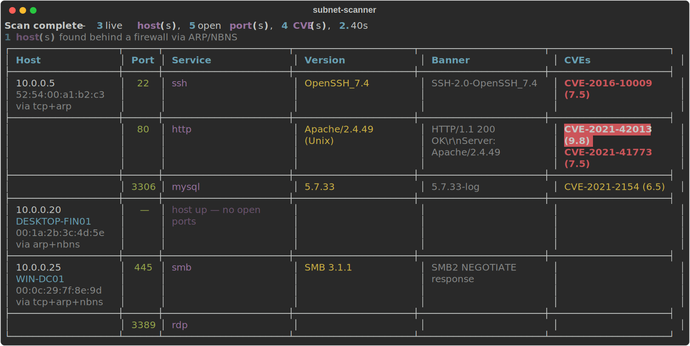

# Subnet Scanner

English · [Русский](#ru)

> Async network reconnaissance tool with vulnerability mapping.
> Combines fast TCP port scanning with NVD CVE lookup so you don't have to
> manually correlate service versions to known issues.


## Demo

A scan of a small mixed network, rendered to the terminal:



The same scan as a [self-contained HTML report](examples/report.html) and as
[JSON](examples/scan.json). 

## Features

- **Firewall-aware host discovery** — three unprivileged signals fused
  together (TCP probe + OS ARP cache + NBNS over UDP/137), so default Windows
  hosts that silently drop every probe are still found, with MAC and computer
  name. No raw sockets, no root. See
  [Finding firewalled Windows hosts](#finding-firewalled-windows-hosts).
- **High-concurrency TCP port scan** with a shared semaphore to bound
  resource use across the whole batch.
- **Service fingerprinting** from banners with dedicated protocol probes
  for SMB (SMB2 NEGOTIATE) and PostgreSQL (StartupMessage), plus a port-
  hint fallback for protocols that don't talk first.
- **NVD CVE lookup** with on-disk SQLite cache (24h TTL), polite rate
  limiting, and exponential-backoff retry. Honours `$NVD_API_KEY` for
  the 50 req/30s tier.
- **Reports** — `rich` terminal table with severity-coloured CVE column,
  pretty-printed JSON, and a self-contained HTML report with sortable
  CVE detail panes.
- **Scan profiles** — `fast` (top 100 ports, aggressive timeout), `full`
  (top 1000 ports, relaxed timeout), `stealth` (rate-limited).
- **Docker lab** under `lab/` with intentionally vulnerable images for
  reproducible end-to-end runs.

## Finding firewalled Windows hosts

The networks this tool targets are mostly Windows, and a default Windows
Defender Firewall **silently drops** inbound packets instead of rejecting
them. A dropped SYN is indistinguishable from a dead host, so ping/TCP
sweeps miss live Windows machines entirely.


| Signal | Layer | Why it gets through a host firewall |
|--------|-------|------------------------------------|
| TCP probe | L4 | A completed *or refused* handshake proves reachability — and primes the ARP cache as a side effect. |
| ARP cache | L2 | A host must answer ARP to use IPv4 at all, so the firewall can't filter it. Read straight from the OS — nothing extra on the wire. |
| NBNS (UDP/137) | L7 | Many Windows hosts answer a node-status query with every TCP port closed, leaking the computer name and adapter MAC. |

ARP and NBNS only see the **local subnet** — an off-subnet target resolves to
the gateway's MAC, never its own — which keeps the lookup free of remote
false positives. Disable either signal with `--no-arp` / `--no-nbns`.

## Requirements

- Python 3.11 or newer
- `pip install -r requirements.txt` (or `pip install -e ".[dev]"` for
  formatter/linter/tests)

## Quickstart

```bash
# Fast scan of localhost, terminal output (CVE lookup runs by default)
python cli.py --target 127.0.0.1 --ports top100

# Full scan of a /24 with both JSON and HTML reports
python cli.py --target 10.0.0.0/24 --profile full --output all \
    --output-file scan_results/lan.json \
    --html-output scan_results/lan.html

# Range syntax, custom port list, no fingerprinting, no CVE traffic
python cli.py --target 192.168.1.1-50 --ports 22,80,443,3389 \
    --no-banner --no-cve

# Stealth profile (slower, throttled connections)
python cli.py --target 192.168.1.10 --profile stealth

# Pass an NVD API key to lift the rate limit
NVD_API_KEY=... python cli.py --target 10.0.0.1 --ports top1000 \
    --output html --html-output scan_results/lan.html

# Sweep a LAN — finds firewalled Windows hosts via ARP + NBNS
python cli.py --target 192.168.1.0/24 --output all

# TCP-only discovery (disable the firewall-aware signals)
python cli.py --target 192.168.1.0/24 --no-arp --no-nbns
```

CLI reference: `python cli.py --help`.

## Trying the Docker lab

The lab spins up Apache 2.4.49 (CVE-2021-41773), an older OpenSSH, vsftpd
and MySQL 5.7 on local-only port mappings:

```bash
cd lab
docker compose up -d
python ../cli.py --target 127.0.0.1 \
    --ports 8081,2121,13306,2222 --output all
docker compose down -v
```

Open `scan_results/last.html` in a browser — every host gets a
collapsible panel with a per-CVE row coloured by CVSS severity, and
direct links to the NVD detail pages.

## Architecture

```
┌──────────────┐   ┌──────────────┐   ┌──────────────────┐   ┌─────────────┐
│  Discovery   │──▶│  Port scan   │──▶│  Fingerprinting  │──▶│ CVE lookup  │
│(TCP+ARP+NBNS)│   │ (semaphore)  │   │ (banner + probes)│   │ (NVD + SQLite)│
└──────────────┘   └──────────────┘   └──────────────────┘   └──────┬──────┘
                                                                    │
                                                                    ▼
                                                          ┌────────────────────┐
                                                          │    ScanResult      │
                                                          └────────┬───────────┘
                                                                   │
                              ┌──────────────────┬─────────────────┼─────────────────┐
                              ▼                  ▼                 ▼                 ▼
                      ┌──────────────┐   ┌──────────────┐   ┌──────────────┐
                      │ rich.Table   │   │ JSON export  │   │ HTML report  │
                      └──────────────┘   └──────────────┘   └──────────────┘
```

Every stage is async and isolated behind a thin function so the
orchestrator can compose them freely. Data flows through plain
`@dataclass` types (`core/models.py`) that round-trip through JSON
without custom encoders beyond `datetime`.

## Project layout

```
subnet-scanner/
├── core/
│   ├── discovery.py      # firewall-aware liveness: TCP + ARP + NBNS
│   ├── arp.py            # reads the OS neighbour (ARP) cache
│   ├── nbns.py           # NBNS/UDP-137 node-status query + parser
│   ├── portscan.py       # connect-scan with shared semaphore
│   ├── fingerprint.py    # banner grab + classifier + SMB/PostgreSQL probes
│   ├── cve_lookup.py     # NVD client, SQLite cache, rate limiter
│   ├── orchestrator.py   # pipeline glue
│   └── models.py         # plain dataclass types
├── reporting/
│   ├── terminal.py       # rich.Table renderer
│   ├── json_report.py    # JSON export
│   └── html_report.py    # Jinja2-based HTML report
├── templates/
│   └── report.html.j2    # self-contained HTML template (inline CSS)
├── tests/                # pytest + pytest-asyncio (86 tests, mocked I/O)
├── examples/             # committed demo output + the generator script
├── lab/                  # docker-compose stand of vulnerable services
├── .github/workflows/    # subnet-scanner-ci.yml (runs from the monorepo root)
└── cli.py                # argparse entry point
```

## Tests

```bash
pytest tests/ -v
pytest tests/ --cov=core --cov=reporting --cov=cli --cov-report=term-missing
ruff check .
black --check .
```


## Responsible use

A reconnaissance tool for networks you own or are explicitly authorised to
test — scanning third-party hosts without permission may be illegal. The
bundled lab (`lab/`) exists so you can exercise every feature against
intentionally vulnerable services you control.


---

<a id="ru"></a>

# Subnet Scanner — на русском

[English](#subnet-scanner) · Русский

> Асинхронный инструмент сетевой разведки с картированием уязвимостей.
> Объединяет быстрый TCP-скан портов с поиском CVE в базе NVD — чтобы не
> сопоставлять версии сервисов с известными уязвимостями вручную.

## Демо

Скан небольшой смешанной сети, вывод в терминал:


Тот же скан в виде [самодостаточного HTML-отчёта](examples/report.html) и
[JSON](examples/scan.json). 

## Возможности

- **Обнаружение хостов с учётом фаервола** — три беспривилегированных
  сигнала вместе (TCP-проба + ARP-кэш ОС + NBNS по UDP/137), поэтому
  Windows-хосты с настройками по умолчанию, молча отбрасывающие все пробы,
  всё равно находятся — вместе с MAC и именем компьютера. Без raw-сокетов и
  root. См. [Поиск Windows-хостов за фаерволом](#поиск-windows-хостов-за-фаерволом).
- **Высококонкурентный TCP-скан портов** с общим семафором, ограничивающим
  потребление ресурсов на всю пачку целей.
- **Фингерпринтинг сервисов** по баннерам с отдельными протокольными пробами
  для SMB (SMB2 NEGOTIATE) и PostgreSQL (StartupMessage), плюс откат по
  номеру порта для протоколов, которые «не отвечают первыми».
- **Поиск CVE в NVD** с локальным SQLite-кэшем (TTL 24 ч), аккуратным
  rate-limiting и повторами с экспоненциальной задержкой. Учитывает
  `$NVD_API_KEY` для тарифа 50 запросов / 30 с.
- **Отчёты** — таблица в терминале (`rich`) с раскраской колонки CVE по
  severity, форматированный JSON и самодостаточный HTML-отчёт с
  раскрывающимися панелями по CVE.
- **Профили сканирования** — `fast` (топ-100 портов, агрессивный таймаут),
  `full` (топ-1000 портов, мягкий таймаут), `stealth` (с троттлингом).
- **Docker-лаборатория** в `lab/` с намеренно уязвимыми образами для
  воспроизводимых сквозных прогонов.

## Поиск Windows-хостов за фаерволом

Сети, под которые сделан инструмент, в основном на Windows, а дефолтный
Windows Defender Firewall **молча отбрасывает** входящие пакеты, а не
отклоняет их. Отброшенный SYN неотличим от мёртвого хоста, поэтому
ping/TCP-сканы вообще не видят живые Windows-машины. Но этот сканер обходит ограничение.


| Сигнал | Уровень | Почему проходит сквозь хостовый фаервол |
|--------|---------|------------------------------------------|
| TCP-проба | L4 | Завершённый *или отклонённый* handshake доказывает доступность — и попутно прогревает ARP-кэш. |
| ARP-кэш | L2 | Хост обязан отвечать на ARP, иначе IPv4 вообще не работает, — фаервол это не фильтрует. Читаем прямо из ОС, в сеть ничего лишнего. |
| NBNS (UDP/137) | L7 | Многие Windows-хосты отвечают на node-status запрос даже при всех закрытых TCP-портах, выдавая имя компьютера и MAC адаптера. |

ARP и NBNS видят только **локальный сегмент** — цель за пределами подсети
резолвится в MAC шлюза, а не в свой, — поэтому ложных срабатываний по
удалённым целям нет. Любой сигнал отключается флагом `--no-arp` / `--no-nbns`.

## Требования

- Python 3.11 или новее
- `pip install -r requirements.txt` (или `pip install -e ".[dev]"` для
  форматтера/линтера/тестов)

## Быстрый старт

```bash
# Быстрый скан localhost, вывод в терминал (поиск CVE включён по умолчанию)
python cli.py --target 127.0.0.1 --ports top100

# Полный скан /24 с отчётами и в JSON, и в HTML
python cli.py --target 10.0.0.0/24 --profile full --output all \
    --output-file scan_results/lan.json \
    --html-output scan_results/lan.html

# Диапазон адресов, свой список портов, без фингерпринтинга и без запросов к CVE
python cli.py --target 192.168.1.1-50 --ports 22,80,443,3389 \
    --no-banner --no-cve

# Профиль stealth (медленнее, с троттлингом соединений)
python cli.py --target 192.168.1.10 --profile stealth

# Передать ключ NVD API, чтобы снять лимит запросов
NVD_API_KEY=... python cli.py --target 10.0.0.1 --ports top1000 \
    --output html --html-output scan_results/lan.html

# Скан LAN — находит зафаерволенные Windows-хосты через ARP + NBNS
python cli.py --target 192.168.1.0/24 --output all

# Только TCP-обнаружение (отключить сигналы, учитывающие фаервол)
python cli.py --target 192.168.1.0/24 --no-arp --no-nbns
```

Справка по CLI: `python cli.py --help`.

## Запуск Docker-лаборатории

Лаборатория поднимает Apache 2.4.49 (CVE-2021-41773), старый OpenSSH, vsftpd
и MySQL 5.7 на портах, проброшенных только на localhost:

```bash
cd lab
docker compose up -d
python ../cli.py --target 127.0.0.1 \
    --ports 8081,2121,13306,2222 --output all
docker compose down -v
```

Открой `scan_results/last.html` в браузере — у каждого хоста раскрывающаяся
панель со строкой по каждому CVE, раскрашенной по severity (CVSS), и прямыми
ссылками на страницы NVD.

## Архитектура

```
┌──────────────┐   ┌──────────────┐   ┌──────────────────┐   ┌─────────────┐
│  Discovery   │──▶│  Port scan   │──▶│  Fingerprinting  │──▶│ CVE lookup  │
│(TCP+ARP+NBNS)│   │ (semaphore)  │   │ (banner + probes)│   │ (NVD + SQLite)│
└──────────────┘   └──────────────┘   └──────────────────┘   └──────┬──────┘
                                                                    │
                                                                    ▼
                                                          ┌────────────────────┐
                                                          │    ScanResult      │
                                                          └────────┬───────────┘
                                                                   │
                              ┌──────────────────┬─────────────────┼─────────────────┐
                              ▼                  ▼                 ▼                 ▼
                      ┌──────────────┐   ┌──────────────┐   ┌──────────────┐
                      │ rich.Table   │   │ JSON export  │   │ HTML report  │
                      └──────────────┘   └──────────────┘   └──────────────┘
```

Каждая стадия асинхронна и изолирована за тонкой функцией, чтобы
оркестратор мог свободно их компоновать. Данные текут через простые
`@dataclass`-типы (`core/models.py`), которые сериализуются в JSON без
кастомных энкодеров, кроме `datetime`.

## Структура проекта

```
subnet-scanner/
├── core/
│   ├── discovery.py      # обнаружение с учётом фаервола: TCP + ARP + NBNS
│   ├── arp.py            # чтение ARP-кэша (таблицы соседей) ОС
│   ├── nbns.py           # NBNS/UDP-137: запрос node-status + парсер
│   ├── portscan.py       # connect-скан с общим семафором
│   ├── fingerprint.py    # захват баннера + классификатор + пробы SMB/PostgreSQL
│   ├── cve_lookup.py     # клиент NVD, SQLite-кэш, rate limiter
│   ├── orchestrator.py   # склейка конвейера
│   └── models.py         # простые dataclass-типы
├── reporting/
│   ├── terminal.py       # рендер rich.Table
│   ├── json_report.py    # экспорт в JSON
│   └── html_report.py    # HTML-отчёт на Jinja2
├── templates/
│   └── report.html.j2    # самодостаточный HTML-шаблон (CSS внутри)
├── tests/                # pytest + pytest-asyncio (86 тестов, I/O замокан)
├── examples/             # закоммиченный демо-вывод + скрипт-генератор
├── lab/                  # docker-compose стенд уязвимых сервисов
├── .github/workflows/    # subnet-scanner-ci.yml (запускается из корня монорепо)
└── cli.py                # точка входа на argparse
```

## Тесты

```bash
pytest tests/ -v
pytest tests/ --cov=core --cov=reporting --cov=cli --cov-report=term-missing
ruff check .
black --check .
```


## Ответственное использование

Инструмент разведки для сетей, которыми ты владеешь или которые тебе явно
разрешено тестировать, — сканирование чужих хостов без разрешения может быть
незаконным. Встроенная лаборатория (`lab/`) нужна именно для того, чтобы
прогонять все возможности на намеренно уязвимых сервисах под твоим контролем.

